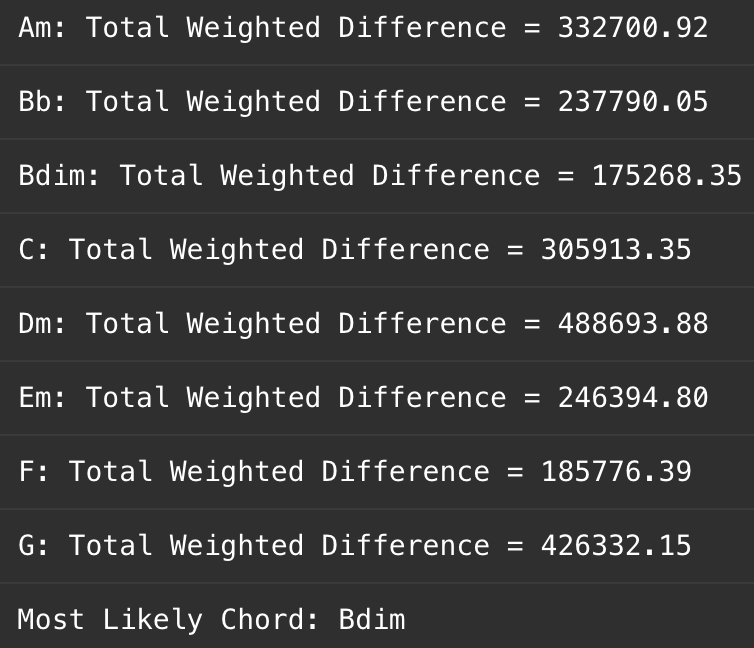
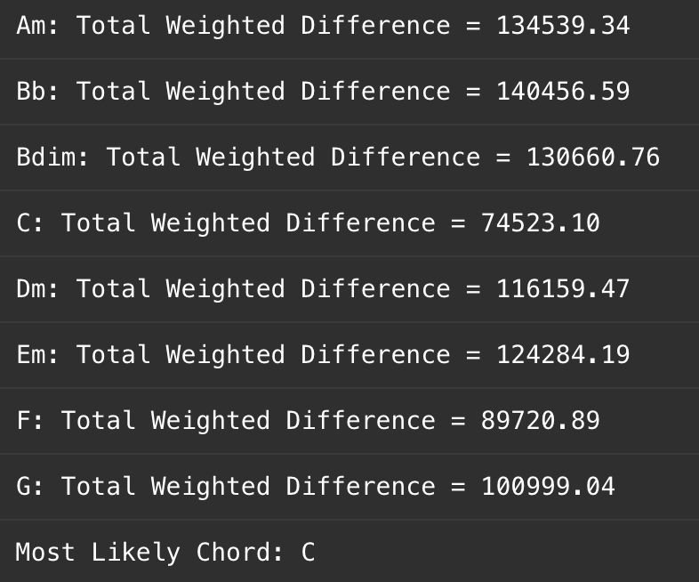
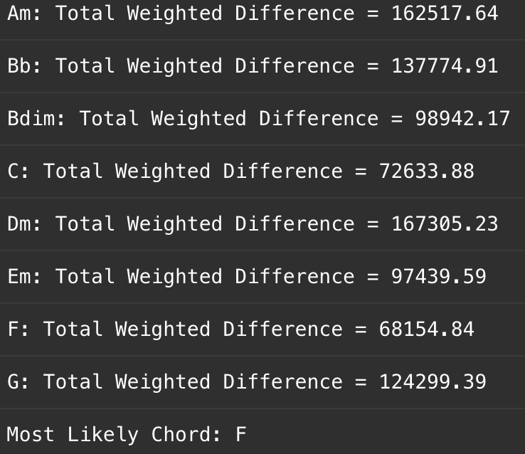
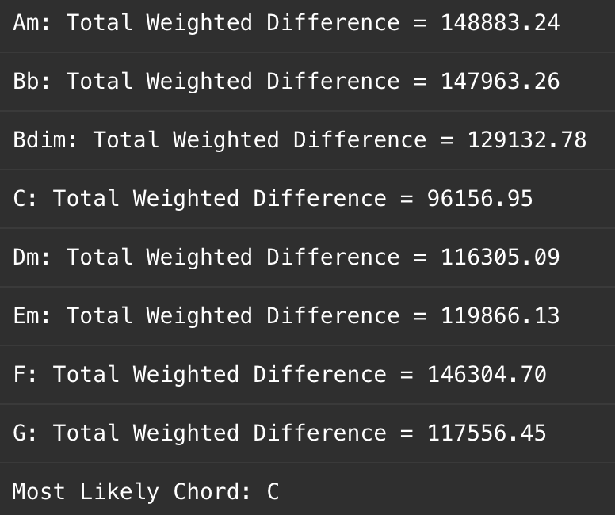

> [!IMPORTANT]
> repo still in construction ...

# Different ways to classify simple guitar chords


### Preparation

- dataset is based on kaggle's guitar chords V3

  > **NOTE:**
  > Not all chords are included, only:
  >
  > ```python
  > chords = {
  >     "Am": [110.00, 164.81, 220.00],  # A, C, E
  >     "Bb": [116.54, 174.61, 233.08], # Bb, D, F
  >     "Bdim": [123.47, 174.61, 246.94], # B, D, F
  >     "C": [130.81, 196.00, 261.63], # C, E, G
  >     "Dm": [146.83, 220.00, 293.66], # D, F, A
  >     "Em": [164.81, 246.94, 329.63], # E, G, B
  >     "F": [174.61, 261.63, 349.23], # F, A, C
  >     "G": [196.00, 293.66, 392.00] # G, B, D
  > }
  > ```

### Methods

- [ ] dsp method
- [ ] neural network method


# Log


### DSP

- **Date:** 2024-02-28 using stft to get frequency spectrum

- accumulate frequency on time axis

- only get frequencies whose magnitude ranks top 6

- **Date:** 2024-03-03 evaluates how closely a given frequency spectrum matches a C major chord. It follows these steps:

  1. **Generate the C Major Chord Frequency Set**: The fundamental frequencies of C (130.81 Hz), G (196.00 Hz), and E (261.63 Hz) are used to create a set of harmonic frequencies by scaling them with powers of 2 (octave shifts).
  2. **Extract Input Spectrum Data**: The detected frequencies and their corresponding magnitudes from an audio signal are provided.
  3. **Find the Nearest C Chord Frequency**: Each input frequency is compared with the C major chord frequency set to find the closest match.
  4. **Compute Weighted Differences**: The absolute frequency difference between each input frequency and its nearest C chord frequency is calculated, then weighted by its magnitude.
  5. **Summing the Weighted Differences**: The final weighted difference sum represents the overall deviation of the input spectrum from the ideal C major chord structure.

  > **NOTE:** probably works probably not. Since the frequency & note are not linear relevant, maybe we need to do logarithmic operations on high frequencies, and do exponentiation operations on low frequencies.

- trying octave (from C3 to C4) normalization, the effect is good at some previous bad samples (all these samples should be C chord but were previously misclassified:

   ➝ 

   ➝ 

- after test on whole training set, the accuracy for each chord varies:

  | Chord | Accuracy |
  | ----- | -------- |
  | Am    | 79.55%   |
  | Bb    | 80.11%   |
  | Bdim  | 48.86%   |
  | C     | 18.75%   |
  | Dm    | 64.20%   |
  | Em    | 73.86%   |
  | F     | 36.36%   |
  | G     | 17.05%   |

	not sure about the reason but it is definitely related to the structure of different types of chord such as major, minor, diminished.

### NN

- using frequency spectrum to train the model (PLAN) as it is more readable to human ; - )
- ... to be continued 

